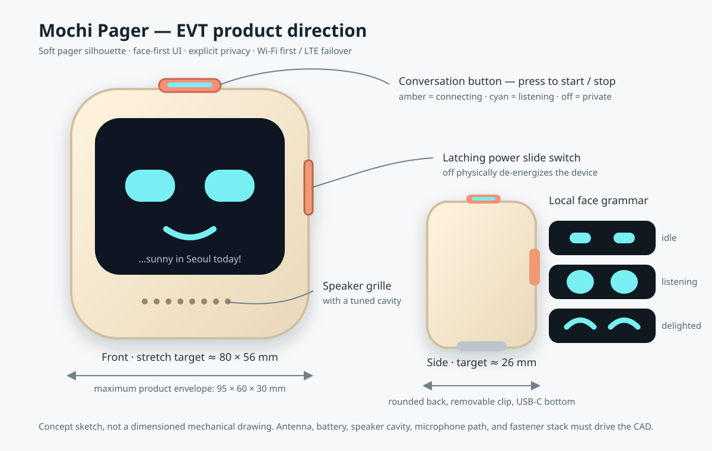

# 0001 — Mochi Pager product concept

Status: Concept selected for EVT  
Date: 2026-08-30  
Maximum envelope: 95 × 60 × 30 mm

## The idea

Mochi is a small voice companion that feels more like a friendly pager than a shrunken phone. Its screen is primarily a face, not an app grid. It reacts instantly when touched or spoken to, maintains a recognizable personality, and makes its listening, thinking, speaking, and offline states legible without demanding attention. A companion mobile app ([ADR 0007](../decisions/0007_use_companion_app_and_cloud_history_sync.md)) onboards the device over BLE and shows an encrypted local cache of the user's opt-in cloud conversation history. The transport and authority boundaries are specified in the [companion-app architecture](0002_companion_app_and_sync_architecture.md).

The reference prototype gets one thing exactly right: two luminous eyes and a little motion create more character than a dense UI. Mochi keeps that clarity while replacing the exposed brass frame and cell with a safe rounded enclosure, explicit privacy controls, measurable acoustics, and a service architecture we own.



## Physical language

- Rounded pebble/pager body with a matte cream, mint, coral, or lavender shell and an optional replaceable silicone bumper.
- Black approximately 1.7–2.0-inch display window occupies most of the front, pending product geometry. The CoreS3 mule fixes only its EVT screen at 2 inches. The normal view has only two large, round, high-contrast eyes—no mouth or lips—and large caption text that enters from beyond the right edge and slides beneath them while the assistant speaks (PR-07). When empty, that caption position has no prompt, border, or colored background. The caption is paced against rendered audio (never more than one caption segment ahead), continues naturally left until fully off-screen after completed playback, and disappears immediately when the user barges in.
- Two microphone ports sit away from the speaker path. A lower-front or lower-side speaker grille points toward the user without hiding behind a hand.
- The product has exactly two physical controls ([ADR 0008](../decisions/0008_use_exactly_two_physical_controls.md)). First, a large illuminated top conversation button: one press requests a session, amber shows connection with capture gated, cyan shows listening, and another press stops from any session state. Gate A uses a touchscreen toggle because the purchased CoreS3 K128's side power button must not be repurposed; a product-like external GPIO button with a visible session indicator is added on the acoustic mule before ergonomic judgment. Second, a latching power slide switch: off de-energizes the system and microphone rails even with charger, debug, or modem paths attached, so verified power-off is the ultimate microphone kill. There are no volume buttons and no separate mute slider; volume lives on the touchscreen and in the companion app.
- On the custom carrier, one capture-enable command net is hardware-biased inactive through reset/boot/crash/watchdog/recovery/OTA, gates the microphone path, and drives the cyan indicator, so firmware cannot command them independently. Component and wiring faults are still tested; only verified hard power-off is hardware-certain.
- USB-C is on the bottom. A lanyard eye and removable back clip support the pager metaphor.
- No camera is part of the MVP. During EVT, physically cover the interaction mule's camera aperture and omit camera drivers/permissions; production hardware omits the sensor entirely.

The public shared answer proposes 95 × 60 × 30 mm; Mochi adopts that as a maximum rather than attributing “maximum” to the source. The EVT stretch target is approximately 80 × 56 × 26 mm, subject to real component, antenna, acoustic-cavity, and battery measurements. Comfort and RF performance take precedence over hitting the stretch dimensions.

The reference footage does not show a discernible mouth or smile. Mochi keeps that restraint: expression comes from the two eyes, their motion, color/light, and the caption—not from a mouth, lips, cheeks, or smile graphic.

## Character and expression system

The face must never wait on the network to acknowledge a physical action. A local state machine drives 30 fps animation and receives optional emotional accents from the assistant. Session, microphone, output, connectivity, and safety are composable signals rather than one exclusive `LISTENING → THINKING → SPEAKING` sequence; Mochi can visibly hear the user while its eye animation still reflects assistant playback.

| Signal/state | Immediate visual behavior | Source of truth |
|---|---|---|
| Booting | Eyes stretch awake; short progress arc | Device |
| Private idle | Conversation-button light off; calm centered gaze at first, a curious gesture after 3–5 seconds, then centered rests of 6–12 seconds between gestures | Capture gate + local expression director |
| Connecting/reconnecting | Conversation button and connection arc amber; microphone uplink gated | Network/session manager + capture gate |
| Live session | Top-left ivory dot fills and glows; it is an empty ivory outline whenever capture is gated. The conversation-button light remains the hardware-coupled capture truth; a separate ivory oval surrounds the eyes | Local capture/session state + cosmetic face renderer |
| User speech | Ivory eyes widen and dark pupils turn slightly inward together | Local VAD |
| Thinking | Pupils make a restrained side-to-side scan only while input is quiet and output is generating | Response state |
| Assistant speech | Large round eyes subtly pulse; the ivory oval changes displacement, thickness, and glow with remote-audio loudness and spectral balance | Local assistant audio output |
| Delighted | Ivory eyes broaden into soft happy apertures and adopt a buoyant rhythm | Validated, expiring assistant accent |
| Confused | The two round eyes use slightly asymmetric size and gaze | Validated, expiring assistant accent/error |
| Caption | Sliding text line beneath the eyes renders assistant speech, paced against rendered audio (at most one segment ahead); continues left off-screen on completion and clears immediately on barge-in | Gateway transcript deltas + playback cursor |
| Offline | Cloud breaks into two pieces; face remains usable | Network manager |
| Low battery | While resting, eyes dim, open less, and look down; random idle gestures stop, while active-conversation movement remains available | PMIC/fuel gauge through power manager |

Expression arbitration is local and layered rather than one winner-takes-all state. Conversation activity owns rig movement, battery capacity owns energy/openness while charging adds an independent glow, expression geometry selects fault/low-capacity before validated affect before an activity default before mood, and active conversation gaze outranks idle curiosity. The ivory apertures always have a low-amplitude emotion-specific alive rhythm. Eligible large idle gestures last 1.6–2.4 seconds: both dark pupils make a fast conjugate saccade while both apertures follow toward up, down, either side, any of four screen corners, or a clockwise/counterclockwise scan, then always return to center. The constrained `set_pager_emotion` Realtime function can choose only one of 28 allowlisted cues and a bounded expiry—it cannot provide CSS, control a status light, or claim that Mochi literally feels an emotion. Its metadata never becomes speech or caption text. Random accents stop for low power and reduced-motion preference and never change amber/cyan/off truth. Cosmetic expression code is not a control dependency: import or initialization failure leaves a calm static face, and later animation faults still cannot remove conversation Start/Stop or capture indication. This avoids a cheerful face when the network has failed or a curious scan that implies listening. Power-off is dark by definition—there is no software "muted" face; private idle with the button light off is the quiet state. See [ADR 0010](../decisions/0010_use_local_hierarchical_expression_arbitration.md).

## Conversation interaction model

EVT targets a button-started, full-duplex conversation. A touchscreen toggle is the first mule input; an illuminated product-like top button replaces it for the acoustic/mechanical mule. From private idle, one press requests the session: amber `CONNECTING` keeps microphone uplink gated, then cyan `LIVE` appears before the first audio frame is sent. Capture remains active while assistant audio plays, so the user can speak naturally, correct Mochi, or barge in without touching the device. A second press from connecting, reconnecting, or live closes capture, clears playback, cancels/truncates reachable model output, and returns to private idle without waiting for the network.

This is session-scoped full duplex, not background always-listening: the microphone sends audio only while cyan capture is visibly asserted continuously in `LIVE`, and the power slide switch overrides every software state by de-energizing the system. Local AEC receives a synchronized speaker-render reference—the CoreS3 mule exposes a speaker-feedback input through its microphone codec—while local VAD drives fast indication and playback stopping and provider semantic VAD identifies utterance boundaries. While Mochi speaks, the caption line slides its words beneath the face in step with rendered audio. For MVP, confirmed speech during assistant output means “interrupt”; non-interrupting backchannel classification is deferred. If the device cannot sustain safe full duplex, it closes the live session and reports the failure instead of silently changing the button into a turn-by-turn control. Half-duplex may remain in developer firmware as an acoustic diagnostic, never as shipping UI or an acceptance pass. BLE is for nearby onboarding, network repair, and bounded diagnostics in the MVP — never conversation audio or history. ESP32-S3 does not support Bluetooth Classic, so ordinary A2DP headphones are explicitly outside the first architecture.

## System shape

```text
 conversation button / power switch
              |
 +------------v-----------+   Security 2 BLE: Wi-Fi/APN/claim   +----------------------+
 | Mochi device           |<====================================>| Companion mobile app |
 | face + paced caption   |                                      | setup + encrypted    |
 | AEC/NS/VAD + uplink    |                                      | history cache        |
 | jitter buffer + speaker|                                      +----------+-----------+
 +------------+-----------+                                                 |
              | duplex TLS media/control                                    | authenticated
              v                                                             | HTTPS config/history
 +------------------------+<================================================+
 | Our device gateway     |=============> OpenAI Realtime
 | auth, codec, policy,   |=============> opt-in memory/tool/search services
 | prompt + config/history|
 +------------------------+
```

The device holds a per-device credential, never a standard OpenAI API key. The gateway authenticates devices, rate-limits use, keeps provider credentials private, normalizes audio and events, forwards transcript deltas for the caption, exposes only allowed tools, assembles versioned Realtime instructions from separately authorized user/history/retrieval/device context, serves the companion app, and makes provider/model changes possible without reflashing every pager. Dynamic context remains labelled data rather than instruction authority, and rendered prompts are never routine log payloads ([ADR 0009](../decisions/0009_use_server_owned_contextual_prompt_assembly.md)).

For development, `gpt-realtime-2.1-mini` is the cost-conscious baseline and `gpt-realtime-2.1` is the quality comparison. The model name stays configuration-driven because model availability and pricing change. The product connects to the OpenAI API; a ChatGPT subscription is not the device backend.

## Connectivity and memory

Wi-Fi is preferred because it is cheaper, cooler, and easier to validate. A phone hotspot is the first cellular-backhaul experience test; it does not validate Mochi's onboard modem, RF, power, carrier compatibility, or failover. Standalone LTE Cat 4 is introduced as an external bench modem/power mule only after the voice experience works over Wi-Fi. Its 56 × 65 mm-class HAT is not an enclosure part. Before carrier freeze, the selected embedded host must prove one exact modem interface under simultaneous encrypted voice, display, and audio load.

When a recoverable route, gateway, or provider transport/session fails, Mochi turns the indicator amber, closes microphone uplink, discards raw/uncommitted input and queued output, establishes a new authenticated transport/application session, and reconstructs only committed conversation items and settled tool results. Entering `reconnecting` starts one non-extendable 10-second capture-reopen timer regardless of failure cause (NW-02c; the 15-second NW-02a bound governs transport restoration, and capture resumes only inside the tighter NW-02c window). Mochi reopens capture and restores cyan `LIVE` only if the authenticated provider session is ready before that deadline. On expiry it clears live intent, turns the button off, returns to private idle, and requires a fresh press even if connectivity later returns. It never buffers speech across the outage or replays a side effect. Full 5G is deferred: current modules impose several antennas, USB 3, multi-amp supply peaks, thermal design, cost, and certification burden without improving the core interaction enough at pager scale.

Local storage contains firmware, face assets, settings, encrypted credentials, and a bounded diagnostic ring buffer. It is not long-term conversational memory. Server-side memory is opt-in and stores compact user facts or summaries, not raw microphone audio by default. Conversation history is a second, separate opt-in (default off): when enabled, the gateway retains finalized transcript items per account and the companion app reads them over authenticated HTTPS—the pager itself never stores or BLE-syncs history ([ADR 0007](../decisions/0007_use_companion_app_and_cloud_history_sync.md)). Saving history alone does not authorize inserting it into future prompts; retained-history context, structured memory, and purpose-scoped search/retrieval have separate authority. Deletion, rebinding, or consent withdrawal also evicts derived indexes and caches from prompt eligibility. The user gets visible controls to inspect, export, forget, or disable memory and history. These promises describe Mochi-controlled storage; context sent for inference is provider-processed, and provider handling/retention is disclosed separately rather than marketed as zero retention. GPS/GNSS remains optional and off unless a concrete feature justifies its privacy and power cost.

## Companion app

The app is the setup and history surface, not a remote control for conversation. A factory-fresh pager automatically enters capture-gated setup; the signed-in app scans its QR and opens an encrypted BLE provisioning session (protocomm Security 2) to deliver Wi-Fi credentials, an optional local cellular profile, and a single-use claim token bound to that device, setup epoch, expected binding generation, and current claim nonce. Wi-Fi passwords plus custom APN/derived-profile/authentication values stay on this nearby encrypted link and are discarded by the app after acknowledgement; signed public carrier-preset metadata may ship or download normally. Account binding and binding-scoped volume, model/voice, consent, and history use the authenticated gateway with ordered revisions; a new owner starts with history retention, retained-history context, and structured-memory consent off. BLE is not a competing history database. A claimed pager can reopen network setup from its touchscreen, or an online pager can receive an authenticated app→gateway request while private-idle; offline recovery uses the boot-only power-on chord defined in the [sync architecture](0002_companion_app_and_sync_architecture.md). Ownership transfer still requires the current owner's release or server-authorized account recovery and purges prior-binding working state plus local Wi-Fi/custom cellular credentials from the pager before another account can use it. The History tab remains available whenever retained records exist even if future saving is off. Delete controls remove authoritative content and connected caches under the published SLA; a disconnected cache locks no later than its 24-hour authorization-lease expiry and erases on its next server contact.

## MVP experience narrative

1. The user slides the power switch on. A factory-fresh Mochi stretches awake in capture-gated setup and displays a QR; an already configured Mochi reconnects in private idle.
2. On first run, the user signs into the companion app, scans the QR, and provisions Wi-Fi (and a local APN profile, when fitted) over encrypted BLE before claiming the device to the account.
3. One touchscreen tap on the first mule—or one top-button press on the product-like mule—requests a session. The button/face show amber `CONNECTING` with uplink gated, then cyan `LIVE` before any microphone frame is transmitted. Pressing again during either state stops locally.
4. The user talks without holding a control. Semantic turn detection recognizes when to respond while the persistent live mark remains visible.
5. Mochi answers aloud; its face moves with output amplitude, its words slide through the caption line beneath the eyes, and its AEC-cleaned microphone path continues listening.
6. The user speaks over the answer. Local VAD stops the audible response promptly, the caption disappears immediately, the gateway cancels and truncates the unheard suffix while retaining a reliable heard boundary for opted-in history, and the user's correction continues in the same session.
7. A second conversation-button press closes both capture and playback. Sliding the power switch off at any time de-energizes the device (only the charger path may remain alive); powering back on returns to private idle and never resumes capture without a fresh conversation-button press.
8. If Wi-Fi disappears, the face explains the change, attempts cellular failover when fitted, and either resumes cyan `LIVE` within the 10-second capture-reopen grace period (NW-02c) or turns the session off and requires a fresh press.
9. Later, in the app — only if the user opted in — the conversation appears in History, where it can be read, exported, or deleted.

## What makes this an EVT rather than a toy demo

The acceptance demo includes app-based BLE onboarding, a button-opened live session, at least ten exchanges without per-turn presses, a live sliding caption that continues left off-screen on completion and clears on interruption, speech-driven barge-in during playback, explicit session stop, power-off as physical kill, offline/reconnect behavior, Wi-Fi and phone-hotspot measurements, two-app opt-in history convergence/deletion, and recorded acoustic/latency/current/data-use evidence. It must work inside an insulating enclosure with an intact protected cell. The exterior is never an electrical ground, and antenna clearance is designed rather than improvised.

Related decisions: [compute mule](../decisions/0001_use_esp32s3_interaction_mule.md), [connectivity](../decisions/0002_use_wifi_first_and_4g_lte_failover.md), [gateway](../decisions/0003_use_secure_realtime_gateway.md), [superseded push-to-talk baseline](../decisions/0004_start_with_push_to_talk_and_ble.md), [PCB strategy](../decisions/0005_build_modular_carrier_before_integrated_rf.md), [full-duplex interaction](../decisions/0006_use_button_started_full_duplex_sessions.md), [companion app and history sync](../decisions/0007_use_companion_app_and_cloud_history_sync.md), [two physical controls](../decisions/0008_use_exactly_two_physical_controls.md), [prompt assembly](../decisions/0009_use_server_owned_contextual_prompt_assembly.md), and [expression arbitration](../decisions/0010_use_local_hierarchical_expression_arbitration.md).
