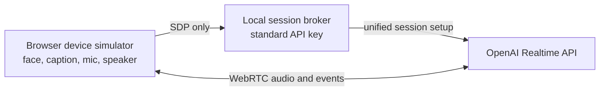

# 0001 — V1 prototype high-level design

Status: V1-A implemented; V1-B planned
Date: 2026-08-31

## What V1 means

V1 is the smallest useful proof of Mochi's interaction, followed by a direct port to the already-purchased M5Stack CoreS3 K128. It is intentionally not the complete EVT backlog in the main requirements document.

| Increment | Purpose | Completion boundary |
|---|---|---|
| V1-A — laptop proof | Prove the live conversation, one-action start/stop contract, full-duplex WebRTC, voice interruption, face states, and sliding assistant caption with the least setup. | Runs in a local browser through the repository's session broker. It does not satisfy the on-device caption, acoustic, hardware-control, or privacy-circuit gates. |
| V1-B — CoreS3 mule | Put the same state/caption contract on the K128, then measure its simultaneous microphone/speaker path and AEC over Wi-Fi. | Runs on the 2-inch device with the camera disabled. Its touchscreen and built-in power control are temporary development substitutes, not proof of the final two physical controls. |

This split carries forward the existing architecture and Claude/user purchase log while removing BLE, cellular, custom-PCB, and account-system work from the beginner's first success path.

## V1 goals

1. One deliberate action requests a live session; the same action stops it from any session state.
2. Amber means connecting and not yet listening. Cyan means the microphone is live. Private idle has no capture.
3. While live, microphone capture and assistant playback remain active at the same time. No per-turn press is required.
4. Speech during assistant playback interrupts the assistant through semantic VAD and WebRTC's managed playback/truncation path.
5. Assistant transcript deltas produce a sliding caption directly below the face. The laptop caption proves the behavior; V1-B must repeat it on the K128 and pass PR-07's identifier, timing, playback-cursor, interruption-trim, and legibility checks before PR-07 may be claimed.
6. The standard OpenAI API key exists only in the local server process, never in browser assets or device firmware.
7. Basic failures are safe and understandable: missing configuration prevents startup, microphone denial or loss fails closed, setup has a bounded readiness deadline, failed session setup closes local media, and Stop immediately closes tracks and playback.

## What is deliberately deferred

- BLE provisioning and the React Native companion app
- account claiming, recovery, ownership transfer, and multi-device synchronization
- durable history, cloud memory, exports, and deletion workflows
- the SIM7600 order, physical-SIM/APN configuration, LTE failover, eSIM, Direct to Cell, and GNSS
- tools or actions with side effects
- custom PCB, external illuminated button, latching hard-power circuit, final battery, and enclosure
- production OTA, exhaustive fault injection, and long soak/acoustic test campaigns

Those features remain in the accepted product architecture. They begin only after the Wi-Fi full-duplex/caption path works.

## Hardware design

### V1-A — available now

- Development computer with Node.js 20 or newer
- Chrome, Edge, or another current WebRTC browser
- Computer microphone and speaker, preferably with headphones available for diagnosis
- Normal 2.4/5 GHz Wi-Fi internet connection

Headphones can confirm the provider and state logic, but the real barge-in/AEC check must also be run through speakers.

### V1-B — after the board arrives

- One M5Stack CoreS3 K128, already purchased on 2026-08-31
- One known-good USB-C data cable
- Laptop USB port or a reputable 5 V USB supply for basic bring-up
- Opaque removable tape for the unused camera
- Phone hotspot for the second Wi-Fi route test

The K128 already contains the ESP32-S3, 320 × 240 touch display, microphones, codec, speaker/amplifier, Wi-Fi/BLE, PSRAM, flash, PMIC, and development battery. Do not add a separate display, microphone, amplifier, battery, modem, or custom enclosure for the first bring-up.

The final product still has exactly two physical controls: an illuminated conversation start/stop button and a latching hard-power slide switch. V1-B temporarily uses a touchscreen conversation control and the K128's own power mechanism. Therefore it cannot pass PR-04 or final ergonomics/privacy-circuit acceptance.

## Software design

### V1-A data path

The browser uses WebRTC because the official OpenAI documentation recommends it for browser/mobile Realtime clients and it automatically manages audio transport. The local broker forwards the initial SDP and session configuration to `POST /v1/realtime/calls`; it never serves the standard key to the browser. This is the simplest current V1 transport, not a reversal of [ADR 0003](../decisions/0003_use_secure_realtime_gateway.md): the product gateway remains the long-term policy, device-identity, tool, quota, history, and observability boundary.

Relevant official documentation:

- [Realtime API with WebRTC](https://developers.openai.com/api/docs/guides/realtime-webrtc)
- [Voice activity detection](https://developers.openai.com/api/docs/guides/realtime-vad)
- [Realtime interruption and truncation](https://developers.openai.com/api/docs/guides/realtime-conversations#interruption-and-truncation)

### Runtime components

| Component | Responsibility |
|---|---|
| `tools/prototype-server/server.js` | Load local configuration, serve only the simulator assets, validate an SDP request, add the server-owned Realtime session configuration, forward it to OpenAI, and return the SDP answer. This local harness is not the product gateway. |
| `tools/device-simulator/app.js` | Own the WebRTC connection, microphone track, returned audio track, provider event handling, local start/stop lifecycle, and DOM rendering. |
| `tools/device-simulator/state.js` | Keep session, input, and output states independent so user and assistant speech can overlap truthfully. Reject stale session events. |
| `tools/device-simulator/caption-pacer.js` | Queue transcript deltas, reveal them behind live audio, bound display text, and discard unrendered text on interruption. |
| `tools/device-simulator/media.js` | Disable and stop every local media track, including a track whose permission request resolves after the user has already pressed Stop. |

### State model

The implementation uses parallel regions rather than a turn-based `LISTENING`/`SPEAKING` toggle.

| Region | States | Important rule |
|---|---|---|
| Session | `inactive`, `connecting`, `live`, `error` | Stop always returns locally to `inactive`; a new start receives a new epoch. |
| Input | `gated`, `quiet`, `user_speaking` | Input can be `user_speaking` while output is `playing`. |
| Output | `idle`, `generating`, `playing` | Output state never disables the microphone track. |

The face is a projection of these facts using only two large round eyes: amber while connecting, cyan while live, raised eyes for user speech, a subtle eye pulse for assistant playback, and a private neutral face while inactive. No mouth or lips are rendered. The large caption band remains visually separate below the eyes.

### Caption behavior

`response.output_audio_transcript.delta` text is keyed to the active response and placed in a pacing queue. Small pieces are revealed into a bounded, single-line track below the face. As each spoken piece arrives, the track retargets from its current rendered position and eases left over most of the 280 ms pacing step, so words enter from the right without snapping. Superseded animation frames are cancelled, reset returns directly to the centered placeholder, and reduced-motion preferences disable the transition. On `input_audio_buffer.speech_started`, WebRTC handles response cancellation and audio truncation while the simulator immediately discards queued, not-yet-shown caption text and rejects late deltas from the interrupted response.

This is an interaction proof, not the final PR-07 alignment algorithm. Browser WebRTC owns the render buffer, so V1-A cannot calculate the K128's exact rendered-sample boundary. V1-B/product firmware must pace against its own playback cursor and trim to the measured heard boundary as the existing requirements specify.

## V1-B port plan

1. Inspect the received K128, photograph its revision, confirm the USB data cable, cover the camera, and do not initialize the camera driver or clock.
2. Run vendor display, touch, microphone, speaker, and Wi-Fi examples without modifying hardware.
3. Port the three-region state reducer and face/caption layout to the 320 × 240 screen.
4. Map one touchscreen area to the invariant conversation start/stop action. Do not add PTT or a software mute mode.
5. Use Espressif's maintained ESP32-S3 WebRTC/OpenAI example as the canonical V1-B media path. A minimal server mints only short-lived client credentials; the standard API key never enters firmware. This direct path is the Gate A reference, not the final product gateway.
6. Prove simultaneous onboard microphone capture and speaker playback, then enable and measure the documented reference/AEC path.
7. Run a ten-exchange Wi-Fi conversation and speak over at least three assistant responses. Key on-device caption deltas to the active `response_id`/`output_id`, pace them from the rendered-sample cursor, show first text within 500 ms of first rendered audio, stay at most one segment ahead, trim to the measured heard boundary on interruption, reject late text/audio, and verify legibility at arm's length on the 2-inch screen.
8. Repeat through a phone hotspot. If full duplex or AEC fails, record the failed gate and diagnose it; do not change the product interaction to push-to-talk.
9. After the direct V1-B reference passes, begin the ADR 0003 product-gateway adapter and measure its added latency against the same script before selecting the embedded product transport.

## Acceptance and non-claims

V1-A passes when the repository setup works, one Start action creates a continuous live session, several exchanges require no further presses, speech interrupts playback, assistant text slides below the face, Stop closes local media, and browser assets contain no standard key.

V1-B passes its first interaction gate when those behaviors run on the K128 over Wi-Fi, the basic simultaneous-audio/AEC measurements are recorded, and the on-device caption trace demonstrates the active response/output identifiers, rendered-cursor pacing, no more than one segment of lead, first text within 500 ms of first rendered audio, heard-boundary trim on interruption, late-delta rejection, and arm's-length legibility. That is the evidence needed to claim the PR-07 gate; V1-B still does not claim compliance with the final latching-power, illuminated-button, hardware capture-gate, enclosure-acoustic, battery, BLE, cellular, cloud-history, or full EVT test requirements.
