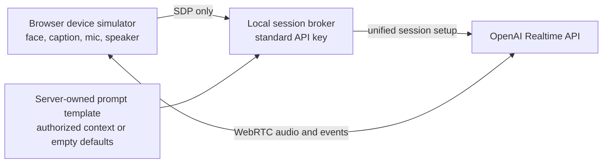

# 0001 — V1 prototype high-level design

Status: V1-A implemented; V1-B planned
Date: 2026-08-31

## What V1 means

V1 is the smallest useful proof of Mochi's interaction, followed by a direct port to the already-purchased M5Stack CoreS3 K128. It is intentionally not the complete EVT backlog in the main requirements document.

| Increment | Purpose | Completion boundary |
|---|---|---|
| V1-A — laptop proof | Prove the live conversation, one-action start/stop contract, full-duplex WebRTC, voice interruption, layered eye expressions, curious idle motion, a server-rendered companion prompt, and sliding assistant caption with the least setup. | Runs in a local browser through the repository's session broker. It does not satisfy the on-device caption, acoustic, hardware-control, authenticated-context, or privacy-circuit gates. |
| V1-B — CoreS3 mule | Put the same state, layout, response-identity, and interruption contract on the K128, replace the browser's visual caption heuristic with rendered-audio pacing, then measure its simultaneous microphone/speaker path and AEC over Wi-Fi. | Runs on the 2-inch device with the camera disabled. Its touchscreen and built-in power control are temporary development substitutes, not proof of the final two physical controls. |

This split carries forward the existing architecture and Claude/user purchase log while removing BLE, cellular, custom-PCB, and account-system work from the beginner's first success path.

## V1 goals

1. One deliberate action requests a live session; the same action stops it from any session state.
2. Amber means connecting and not yet listening. Cyan means the microphone is live. Private idle has no capture.
3. While live, microphone capture and assistant playback remain active at the same time. No per-turn press is required.
4. Speech during assistant playback interrupts the assistant through semantic VAD and WebRTC's managed playback/truncation path.
5. Assistant transcript deltas produce a sliding caption directly below the face. The laptop proves only the browser's fixed-speed visual queue and interruption behavior; V1-B must replace that heuristic with rendered-audio pacing on the K128 and pass PR-07's identifier, timing, playback-cursor, completion-exit, interruption-clear, heard-boundary-accounting, and legibility checks before PR-07 may be claimed.
6. The standard OpenAI API key exists only in the local server process, never in browser assets or device firmware.
7. Basic failures are safe and understandable: missing configuration prevents startup, microphone denial or loss fails closed, setup has a bounded readiness deadline, failed session setup closes local media, and Stop immediately closes tracks and playback.
8. Two large round eyes begin with a calm centered gaze, perform their first synchronized idle gesture after 3–5 seconds, then return to center for randomized 6–12 second pauses. Conversation activity, battery state, validated affect, and ambient mood compose through a deterministic local priority rule; speech or reduced-motion preference cancels random movement.
9. The gateway builds Realtime instructions from a versioned `prompt/*.ftl` companion template. The renderer reconstructs only allowlisted server-selected user, history, retrieval/search, and device context; browser SDP cannot supply prompt text. Production context selection, not the generic renderer, proves that a history record is finalized and authorized.

## What is deliberately deferred

- BLE provisioning and the React Native companion app
- account claiming, recovery, ownership transfer, and multi-device synchronization
- durable history, cloud memory, exports, and deletion workflows
- authenticated production context retrieval and its consent/account services (V1 renders truthful empty defaults and test fixtures only)
- the SIM7600 order, physical-SIM/APN configuration, LTE failover, eSIM, Direct to Cell, and GNSS
- tools or actions with side effects
- custom PCB, external illuminated button, latching hard-power circuit, final battery, and enclosure
- production OTA, exhaustive fault injection, and long soak/acoustic test campaigns

Those features remain in the accepted product architecture. They begin only after the Wi-Fi full-duplex/caption path works.

## Hardware design

### V1-A — available now

- Development computer with Node.js 20 or newer
- Chrome, Edge, or another current WebRTC browser
- Computer microphone and speaker, preferably with headphones available for diagnosis
- Normal 2.4/5 GHz Wi-Fi internet connection

Headphones can confirm the provider and state logic, but the real barge-in/AEC check must also be run through speakers.

### V1-B — after the board arrives

- One M5Stack CoreS3 K128, already purchased on 2026-08-31
- One known-good USB-C data cable
- Laptop USB port or a reputable 5 V USB supply for basic bring-up
- Opaque removable tape for the unused camera
- Phone hotspot for the second Wi-Fi route test

The K128 already contains the ESP32-S3, 320 × 240 touch display, microphones, codec, speaker/amplifier, Wi-Fi/BLE, PSRAM, flash, PMIC, and development battery. Do not add a separate display, microphone, amplifier, battery, modem, or custom enclosure for the first bring-up.

The final product still has exactly two physical controls: an illuminated conversation start/stop button and a latching hard-power slide switch. V1-B temporarily uses a touchscreen conversation control and the K128's own power mechanism. Therefore it cannot pass PR-04 or final ergonomics/privacy-circuit acceptance.

## Software design

### V1-A data path

The browser uses WebRTC because the official OpenAI documentation recommends it for browser/mobile Realtime clients and it automatically manages audio transport. The local broker forwards the initial SDP and server-owned session configuration to `POST /v1/realtime/calls`; its HTTP response contains only SDP and never the standard key. The provider may echo session instructions in `session.created` to the connected client, so rendered context must still contain no server secrets. Realtime `instructions` become the default system guidance for the session, but they are not an authorization mechanism and model compliance is not guaranteed. This is the simplest current V1 transport, not a reversal of [ADR 0003](../decisions/0003_use_secure_realtime_gateway.md): the product gateway remains the long-term policy, device-identity, tool, quota, history, context-consent, and observability boundary.

Relevant official documentation:

- [Realtime API with WebRTC](https://developers.openai.com/api/docs/guides/realtime-webrtc)
- [Voice activity detection](https://developers.openai.com/api/docs/guides/realtime-vad)
- [Realtime interruption and truncation](https://developers.openai.com/api/docs/guides/realtime-conversations#interruption-and-truncation)
- [Realtime call/session configuration](https://developers.openai.com/api/reference/python/resources/realtime/subresources/calls/methods/accept)

### Runtime components

| Component | Responsibility |
|---|---|
| `prompt/mochi-realtime.ftl` | Hold the versioned companion identity, spoken-style rules, context trust rules, and scalar slots for user, server-selected history, retrieval/search, and device context. |
| `tools/prototype-server/prompt-builder.js` | Validate the constrained FreeMarker-compatible scalar template, rebuild allowlisted context objects, enforce category/final-size budgets, escape JSON boundaries, reject several obvious credential patterns, and deterministically render Realtime instructions. It never evaluates directives or recursively renders inserted text; production selection/redaction remains responsible for classifying arbitrary secrets and finalized records. |
| `tools/prototype-server/server.js` | Load local configuration, serve only the simulator assets, validate an SDP request, obtain context from a server-only provider, render the server-owned Realtime session configuration, forward it to OpenAI, and return the SDP answer. This local harness is not the product gateway. |
| `tools/device-simulator/app.js` | Own the WebRTC connection, microphone track, returned audio track, provider event handling, local start/stop lifecycle, and DOM rendering. It binds Start/Stop before dynamically loading the optional face controller, preserving a static fallback if that enhancement fails. |
| `tools/device-simulator/state.js` | Keep session, input, and output states independent so user and assistant speech can overlap truthfully. Reject stale session events. |
| `tools/device-simulator/caption-pacer.js` | Queue active-response transcript additions, reveal them behind playback onset into a response-scoped buffer, and discard queued, unrendered text on interruption. The browser retains the complete active response so its slower visual track cannot lose an unseen prefix. |
| `tools/device-simulator/caption-motion.js` | Keep the active browser caption moving left at one fixed visual speed without per-word retargeting, and snap resets or reduced-motion updates. |
| `tools/device-simulator/expression-director.js` | Derive a face pose from independent activity, affect, battery, and mood channels; schedule centered, bounded idle curiosity; call injected browser timers without the director as their receiver; and cancel work deterministically when a higher-priority fact arrives. |
| `tools/device-simulator/media.js` | Disable and stop every local media track, including a track whose permission request resolves after the user has already pressed Stop. |

### State model

The implementation uses parallel regions rather than a turn-based `LISTENING`/`SPEAKING` toggle.

| Region | States | Important rule |
|---|---|---|
| Session | `inactive`, `connecting`, `live`, `error` | Stop always returns locally to `inactive`; a new start receives a new epoch. |
| Input | `gated`, `quiet`, `user_speaking` | Input can be `user_speaking` while output is `playing`. |
| Output | `idle`, `generating`, `playing` | Output state never disables the microphone track. |

The face is a projection of these facts using only two large round eyes: the top-left ivory dot remains an empty outline while capture is gated and fills with a restrained ivory glow only while listening is live; connecting/error wording remains available to assistive technology rather than occupying the face. User speech produces attentive eyes, assistant playback produces a subtle eye pulse, and private idle begins with a calm centered face before brief curious gestures. No mouth or lips are rendered. The caption remains spatially separate below the eyes, but its idle state has no placeholder text, border, or tinted background.

### Expression behavior

The safety/session reducer above remains authoritative and contains no randomness. A separate expression director computes activity, expression, battery energy plus charging, mood, and gaze data attributes. The channels compose: activity owns conversation rig motion; capacity owns openness/energy while charging adds a glow; expression geometry selects fault/low capacity before validated affect before an activity default before mood; and active conversation gaze outranks idle motion. The browser optionally maps its host Battery Status API into capacity/charging signals; absence of that API leaves a normal prototype default, while V1-B must use the board's PMIC/fuel-gauge reading.

During eligible idle time, an injectable random source chooses a 3–5 second first delay and 6–12 second repeat delays. Both dark pupils and ivory apertures then move together for 1.6–2.4 seconds: look up, down, side to side, toward any of four screen corners, or scan clockwise/counterclockwise. A main saccade, correction, fixation, and rapid return make the target look intentional. A separate low-amplitude outer-eye animation runs continuously and changes cadence by emotion. Speech, response generation, connection/fault state, low battery, hidden-page state, or reduced-motion preference cancels large random gaze immediately; reduced motion disables both layers. Animation ownership is layered so transforms do not fight: the eye rig owns conversation activity, a whole-eye carrier owns the larger target shift, another carrier owns emotional “alive” motion, the ivory aperture owns blinking and geometry, and the pupil owns precise gaze. The model calls the constrained `set_pager_emotion` function before speech; its allowlisted value expires locally and never alters the listening indicator or appears in spoken/caption text.

The browser's expression controller is intentionally optional. Static HTML supplies the initial neutral/calm centered face, and `app.js` binds the conversation control before asynchronously importing the director. An import or constructor failure retains that static face and records only a sanitized diagnostic. A later animation fault may stop cosmetic movement, but Start/Stop, the session reducer, captions, and capture indication are already installed and continue. Timer adapters invoke supplied callbacks as plain functions rather than methods on the director, preventing the browser receiver mismatch that caused the original regression.

### Prompt construction

`prompt/mochi-realtime.ftl` begins with `You are a companion` and contains explicit sections for user context, reconstructed past conversation history, other retrieved/search context, and device/session context. The gateway renderer accepts only the five known `${name}` scalar placeholders, performs one non-recursive substitution pass, serializes dynamic records as bounded escaped JSON, rejects unknown schemas, unsupported syntax, and several recognizable credential shapes, sanitizes search URL userinfo/query/fragment data, and caps the final instructions at 24 KiB. This is a deliberately constrained FreeMarker-compatible subset, not a full FreeMarker runtime. It is defense in depth, not a comprehensive secret classifier; the production context selector/redactor must enforce MP-06 and finalization before rendering.

The localhost harness truthfully renders history/user context as unavailable and retrieval as not requested. Tests can inject server-side fixtures to prove the seam, but the browser cannot add context to its SDP. Production must authenticate `(account_id, device_id, binding_generation)` and check separate history-retention, history-for-context, structured-memory, and retrieval permissions before selecting records. Deleted or prior-owner data and its derived indexes/caches are ineligible. Rendered prompts are provider-processed data and are not routine log payloads. See [ADR 0009](../decisions/0009_use_server_owned_contextual_prompt_assembly.md).

### Caption behavior

`response.output_audio_transcript.delta` text is keyed to the active response and placed in a playback-onset-gated reveal queue. Before the first nonempty piece can paint, the response line is positioned just beyond the caption viewport's right edge. It then enters from right to left over the transparent screen surface at a fixed **60 CSS px/s**; short responses continue to the zero position, while long responses keep moving through their overflow. This intentionally slow browser presentation may trail audio and token arrival; its visual rate is independent of audio cadence, token cadence, word length, and transcript arrival. New text extends the line ahead without restarting, easing, accelerating, or decelerating the track. When playback completes, the whole line travels beyond the right edge over a bounded 750 ms exit and then clears. A caption reset clears the text and snaps its offset to zero instead of sliding back; with `prefers-reduced-motion`, position updates snap rather than animate. On `input_audio_buffer.speech_started`, WebRTC handles response cancellation and audio truncation while the simulator immediately clears displayed and queued text and rejects late deltas from the interrupted response.

The fixed-speed browser track is an interaction and motion heuristic, not the final PR-07 alignment algorithm. Its speed is intentionally independent of what has been heard, and browser WebRTC owns the render buffer, so V1-A cannot calculate the K128's exact rendered-sample boundary. V1-B/product firmware must instead schedule caption presentation from its own playback cursor, clear the display immediately on interruption, and retain the measured heard boundary for cancellation and opted-in history; the browser's `60 CSS px/s` value is not an on-device timing target.

## V1-B port plan

1. Inspect the received K128, photograph its revision, confirm the USB data cable, cover the camera, and do not initialize the camera driver or clock.
2. Run vendor display, touch, microphone, speaker, and Wi-Fi examples without modifying hardware.
3. Port the three-region state reducer and face/caption layout to the 320 × 240 screen.
4. Map one touchscreen area to the invariant conversation start/stop action. Do not add PTT or a software mute mode.
5. Use Espressif's maintained ESP32-S3 WebRTC/OpenAI example as the canonical V1-B media path. A minimal server mints only short-lived client credentials; the standard API key never enters firmware. This direct path is the Gate A reference, not the final product gateway.
6. Prove simultaneous onboard microphone capture and speaker playback, then enable and measure the documented reference/AEC path.
7. Run a ten-exchange Wi-Fi conversation and speak over at least three assistant responses. Key on-device caption deltas to the active `response_id`/`output_id`, pace them from the rendered-sample cursor, show first text within 500 ms of first rendered audio, stay at most one segment ahead, exit right on normal completion, clear immediately on interruption, retain the measured heard boundary for cancellation/history, reject late text/audio, and verify legibility at arm's length on the 2-inch screen.
8. Repeat through a phone hotspot. If full duplex or AEC fails, record the failed gate and diagnose it; do not change the product interaction to push-to-talk.
9. After the direct V1-B reference passes, begin the ADR 0003 product-gateway adapter and measure its added latency against the same script before selecting the embedded product transport.

## Acceptance and non-claims

V1-A passes when the repository setup works, one Start action creates a continuous live session, several exchanges require no further presses, speech interrupts playback, and every assistant caption enters from beyond the right edge at a fixed 60 CSS px/s without easing or per-word speed changes while additions queue ahead. Completed captions exit fully through the right edge, interruption clears immediately, a reset snaps to zero, reduced-motion mode snaps position changes, Stop closes local media, and browser assets contain no standard key. The ivory oval around the eyes samples only remote assistant audio: loudness controls its displacement/thickness/glow while spectral balance adds a restrained intonation cue. While idle, the face starts centered, demonstrates synchronized up/down, side-to-side, and clockwise/counterclockwise roll behavior, returns to center after each 1.6–2.4 second gesture, and uses the 3–5 second first/6–12 second repeat timing bands; active conversation, low battery, hidden state, and reduced motion suppress or cancel it. Tests also prove that timer callbacks do not receive the director as their receiver and that the optional expression load occurs after Start/Stop wiring, so cosmetic failure cannot disable conversation control. Automated tests prove expression priority/timer invalidation and that the gateway—not browser SDP—renders the versioned companion prompt with truthful empty defaults or injected allowlisted fixtures.

V1-B passes its first interaction gate when the session, face, and interruption behaviors run on the K128 over Wi-Fi, the basic simultaneous-audio/AEC measurements are recorded, and the on-device caption replaces V1-A's motion heuristic with a trace demonstrating active response/output identifiers, rendered-cursor pacing, no more than one segment of lead, first text within 500 ms of first rendered audio, completion exit, immediate interruption clear, reliable heard-boundary accounting, late-delta rejection, and arm's-length legibility. That is the evidence needed to claim the PR-07 gate; V1-B still does not claim compliance with the final latching-power, illuminated-button, hardware capture-gate, enclosure-acoustic, battery, BLE, cellular, cloud-history, or full EVT test requirements.
